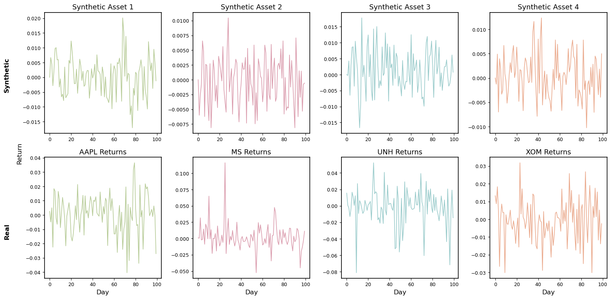
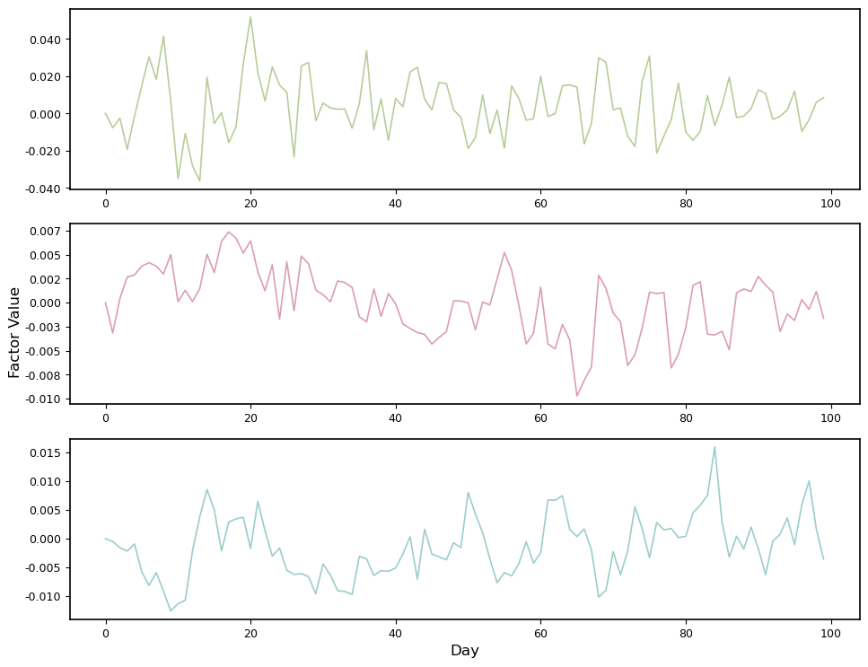
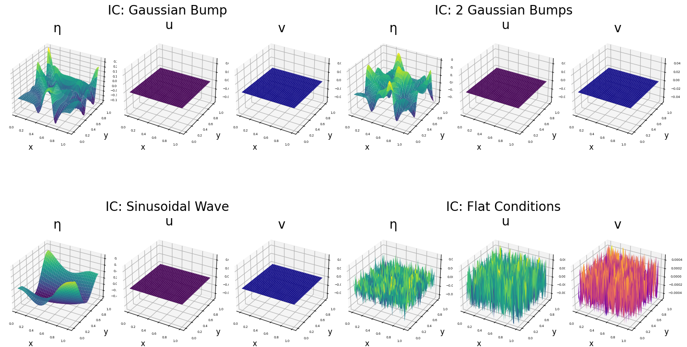
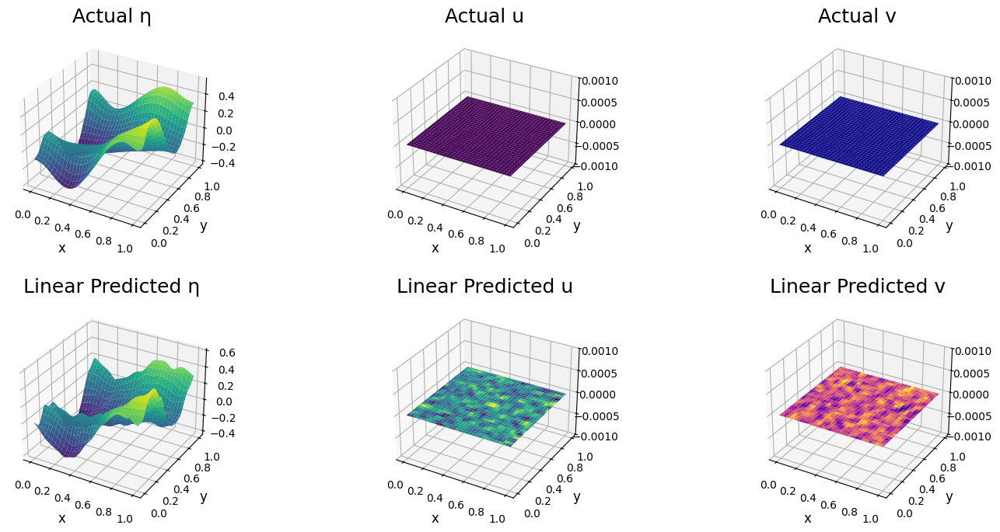

# Model-Aware and Data-Driven Inference

Contributors: [Alexander DeLise](https://www.linkedin.com/in/alexanderdelise/), [Kyle Loh](https://www.linkedin.com/in/kyle-loh-a2a3272a9/), [Krish Patel](https://www.linkedin.com/in/krish-patel-1a8804224/), [Meredith Teague](https://www.linkedin.com/in/meredithcteague/)

Advisors: Andrea Arnold, Matthias Chung

This repository was made for the "Model-Aware and Data-Driven Inference" project from the Summer 2025 "Model Meets Data REU" in Emory University's Math Department. More information can be found on the [REU website](https://www.math.emory.edu/site/cmds-reuret/summer2025/).

- Our ArXiV manuscript "Optimal Linear Baseline Models for Scientific Machine Learning" can be found [here](https://example.com).

- Our poster can be found [here](https://drive.google.com/file/d/1kZ1RPy-E8zGCxs_8ntEbNDc42YKNFbQ0/view?usp=drive_link).


This project is supported by NSF DMS-2349534. 

# Instructions
## Basic Demo
The `demo.py` script provides code to compute the theoretically optimal mappings for the forward and inverse end-to-end problems, as well as for autoencoding and denoising. It generates a random input data matrix $\mathbf{X}$ and constructs the corresponding observation matrix $\mathbf{Y}$ using a rank-deficient forward operator. 

To generate affine linear mappings instead, set `affine = True`.


## Biomedical Imaging with $\texttt{MedMNIST}$ Experiment
To get started, install the $\texttt{MedMNIST}$ dataset package by running:
```python
pip install medmnist
```
More details about the $\texttt{MedMNIST}$ dataset can be found on the [official website](https://medmnist.com/). 

We provide separate `Python` notebooks for the following problem formulations:
- General forward and inverse end-to-end mappings
- Autoencoding
- Data denoising
- Each of the above, along with their affine linear counterparts

Each notebook will generate:
- A representative error comparison sample
- A rank sweep plot

For example:

<div align="center"> 
     
</div> 
<div align="center"> 
     
</div>

We use `PyTorch` to run all experiments. If you have an NVIDIA GPU, computations will automatically utilize it for acceleration. The results, including pickle files of learned and optimal mappings at various ranks, are stored in organized subdirectories.

In the `SpecialErrorComparisonPlot` folder, we include scripts to generate side-by-side comparison plots for each problem type, with their affine linear variants. For example:

<div align="center">  </div>


## Financial Experiment

The `Financial` folder contains code for two case studies: `Synthetic` and `Market`. Each study includes a full pipeline for data generation, model training, and analysis.

### Synthetic

This case study uses generated data from a GARCH model to test the full autoencoder pipeline.

- `toyDataGARCH.ipynb`  
  **Must be run first** – generates the CSV files required by the rest of the synthetic pipeline:
  - `latentFactors_garch.csv`: latent factor matrix
  - `assetReturns_garch.csv`: asset returns
  - `factorLoadings_garch.csv`: factor loading matrix

- `syntheticAEScript.ipynb`  
  Full synthetic pipeline. After generating the CSVs above, this notebook runs end-to-end:
  - Builds and trains the model
  - Computes the optimal projection analysis (OPA)
  - Performs post-training analysis


### Market

This case study uses real market data. To get started, install the `yfinance` pakcage via the command 
```python
pip install yfinance
```

- `stockUniverseNames.ipynb`  
  Generates `stockUniverseNames.csv`, listing all stocks in the universe with GICS sector and full name.  
  _Note: Not required to run the main pipeline._

- `marketAEScript.ipynb`  
  Complete pipeline for real stock data:
  - Builds the stock universe
  - Downloads Fama-French factors
  - Builds, trains, and tests the model
  - Applies varimax rotation and performs analysis  
  _Note: The Kenneth French dataset source may change format or links over time. Manual updates to the code may be needed._


### Visualizations

**Also requires `yfinance` and other dependencies.**

- `plotter.ipynb`  
  Generates visualizations for both `Synthetic` and `Market` case studies:
  1. Compare 4 synthetic vs 4 real asset returns over 100 days  
  2. Plot latent factor values over 100 days  
  3. (**Requires prior construction of stock framework**) Visualize GICS sector breakdown of selected stocks
  4. Example figures include:
<div align="center">
  
</div>

<div align="center">
    
</div>

 


## Shallow Water Equations Experiment

All code for the shallow water experiments is contained in the `SWE` folder. It includes tools for generating datasets, computing optimal linear models, and training and evaluating nonlinear models using `PyTorch`. All computations will run on GPU if available.

* `createSWE.py`  
  Used to generate the different training and testing datasets for our shallow water experiments.  
  - Can be run as a standalone script  
  - Requires `torch` and `numpy`  
  - Saves the data and initial conditions into two separate `.pt` files for each type of initial condition  
  - Parameters for data generation (e.g., noise level, resolution, condition type) can be varied
  - Detailed descriptions of all functions are provided in-file

* `finalSW.ipynb`  
  Main notebook for the **nonlinear learned approach**.  
  - Defines the model architecture  
  - Includes the training loop, error computation, and result plotting

* `linear.ipynb`  
  Notebook for the **optimal linear approach**.  
  - Computes the theoretically optimal linear model  
  - Evaluates error and plots results

* Notebooks create plots of the initial conditions and predicted results. For example:
<div align="center">
  
</div>

<div align="center">
  
</div>