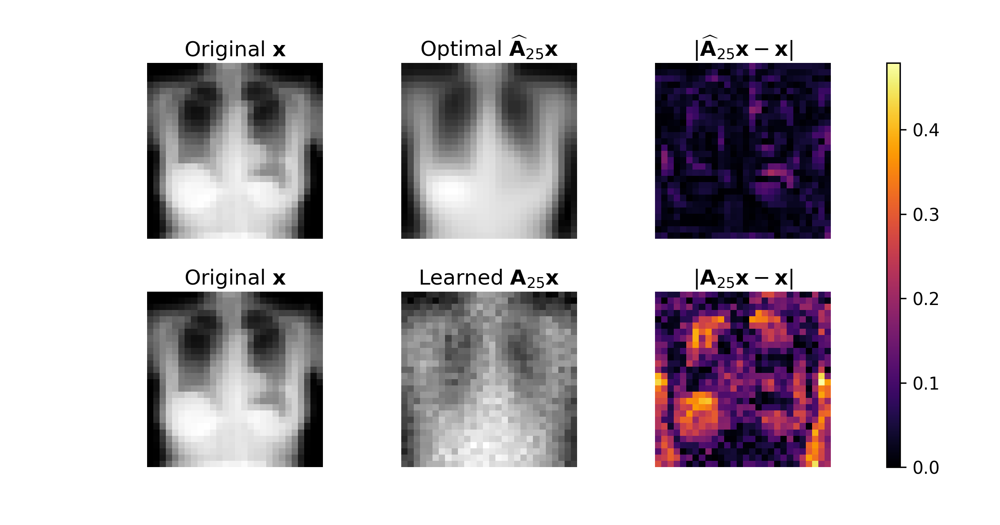
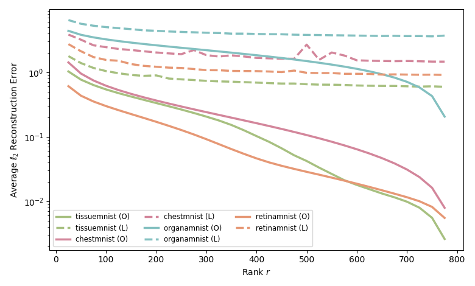
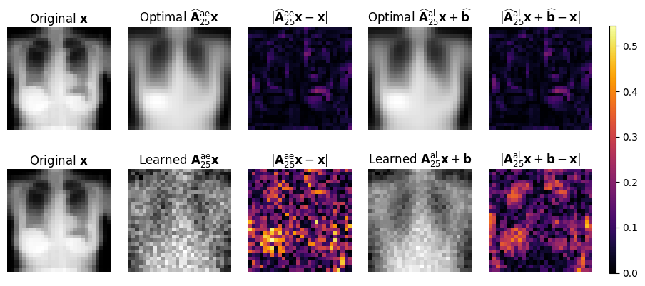

# Model-Aware and Data-Driven Inference

Contributors: [Alexander DeLise](https://www.linkedin.com/in/alexanderdelise/), [Kyle Loh](https://www.linkedin.com/in/kyle-loh-a2a3272a9/), [Krish Patel](https://www.linkedin.com/in/krish-patel-1a8804224/), [Meredith Teague](https://www.linkedin.com/in/meredithcteague/)

Advisors: Andrea Arnold, Matthias Chung

This repository was made for the "Model-Aware and Data-Driven Inference" project from the Summer 2025 "Model Meets Data REU" in Emory University's Math Department. More information can be found on the [REU website](https://www.math.emory.edu/site/cmds-reuret/summer2025/).

This project is partially supported by NSF DMS-2349534. 

# Instructions
## Basic Demo
The `demo.py` script provides code to compute the theoretically optimal mappings for the forward and inverse end-to-end problems, as well as for autoencoding and denoising. It generates a random input data matrix $\mathbf{X}$ and constructs the corresponding observation matrix $\mathbf{Y}$ using a rank-deficient forward operator. 

To generate affine linear mappings instead, set `affine = True`.


## Biomedical Imaging with $\texttt{MedMNIST}$
To get started, install the $\texttt{MedMNIST}$ dataset package by running:
```python
pip install medmnist
```
More details about the $\texttt{MedMNIST}$ dataset can be found on the [official website](https://medmnist.com/). 

We provide separate `Python` notebooks for the following problem formulations:
- General forward and inverse end-to-end mappings
- Autoencoding
- Data denoising
- Each of the above, along with their affine linear counterparts

Each notebook will generate:
- A representative error comparison sample
- A rank sweep plot

For example:

<div align="center">  </div> <div align="center">  </div>

We use `PyTorch` to run all experiments. If you have an NVIDIA GPU, computations will automatically utilize it for acceleration. The results, including pickle files of learned and optimal mappings at various ranks, are stored in organized subdirectories.

In the `SpecialErrorComparisonPlot` folder, we include scripts to generate side-by-side comparison plots for each problem type, with their affine linear variants. For example:

<div align="center">  </div>


## Financial

The Financial folder contains code that pertains to two case studies: Synthetic and Market. 
SYNTHETIC 
toyDataGARCH.ipynb -> ** synthetic only ** you have to run this before you can run the AE script bc this generates the csvs that you need listed below: (self explanatory?)
latentFactors_garch.csv -> generated latent factor matrix. 
assetReturns_garch.csv -> generated asset returns. 
factorLoadings_garch.csv -> generated factor loading matrix

syntheticAEScript.ipynb -> the whole pipeline for synthetic. once you have the csvs from above, you should just be able to run this no problem. includes model building/training/testing, OPA and analysis. 

MARKET
** you have to install yfinance and other things before you can run these ** 
stockUniverseNames.ipynb -> code for generating stockUniverseNames.csv which provides a list of all of the stocks in the market stock universe, along with their GICS sector and full name. ** not necessary for running pipeline ** 
marketAEScript.ipynb -> full market data pipeline. Includes building stock universe, downloading fama french factors, model building/training/testing, varimax rotation and analysis. Note: the link/file type/headers of Kenneth French Data can change frequently, manual updates to code may be necessary.

VISUALIZATIONS
** this also requires yfinance among other things ** 
plotter.ipynb -> contains visualizations for both synthetic and market examples. plot 1) 4 synthetic asset returns over 100 days vs 4 real asset returns over 100 days. plot 2) latent factor values over 100 days. plot 3) ** requires building stock framework before visualization ** GICS sector breakdown of stock framework. 


## Shallow Water Equations


# Relevant Links
- Our poster can be found [here](https://drive.google.com/file/d/1kZ1RPy-E8zGCxs_8ntEbNDc42YKNFbQ0/view?usp=drive_link).

- Our ArXiV manuscript can be found here
